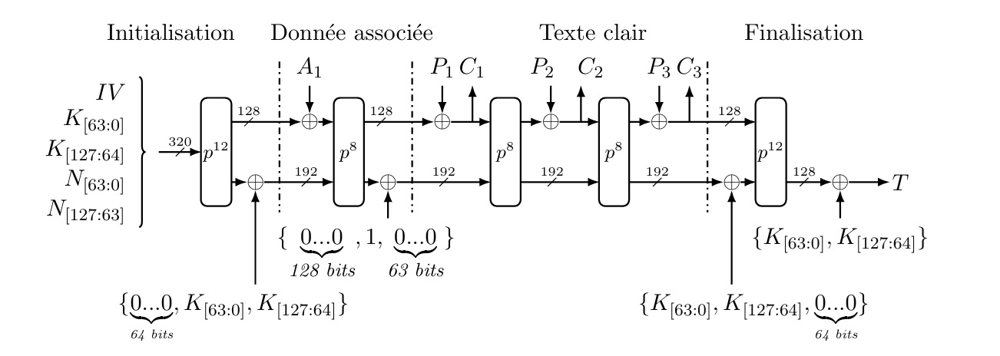
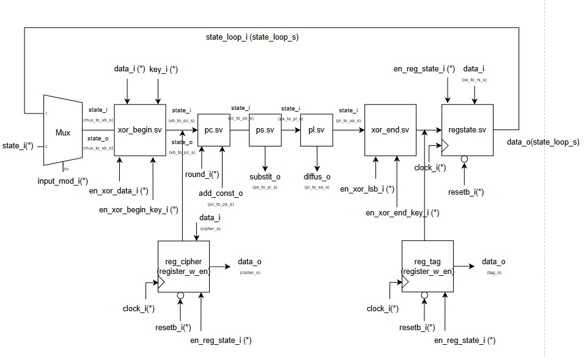

# ASCON-AEAD128 — Modélisation Matérielle en SystemVerilog

Ce dépôt présente une implémentation matérielle hiérarchisée de l'algorithme de chiffrement léger **ASCON-AEAD128**, standardisé par le NIST pour les environnements contraints.

Le projet repose sur une **approche modulaire en SystemVerilog**, accompagnée d'une validation fonctionnelle par simulation (ModelSim), dans le cadre d’un enseignement de **conception numérique**.

---

## Présentation de l'algorithme ASCON

ASCON est un algorithme de **chiffrement authentifié avec données associées (AEAD)**, structuré autour d’un **état interne de 320 bits** représenté par 5 registres de 64 bits. Il opère selon un schéma de permutation successives permettant de garantir simultanément :

- la **confidentialité** via un chiffrement par blocs,
- l’**intégrité** via un tag d’authentification.

L’état interne S est constitué de 5 registres de 64 bits :
S = {S₀, S₁, S₂, S₃, S₄} ∈ 𝔽₂³²⁰

Les quatre phases principales sont :
1. **Initialisation** par injection de la clé, du nonce et d’un vecteur IV,
2. **Absorption des données associées** (optionnelles),
3. **Chiffrement du texte clair** via des blocs successifs,
4. **Finalisation** et extraction du tag d’authenticité.

Chaque phase s’appuie sur des permutations internes notées \( p^a \), \( p^b \), combinant :
- **Ajout de constantes (pc)** : injection de nonces ou clés via XOR,
- **Substitution non linéaire (ps)** : application d'une S-box sur chaque colonne,
- **Diffusion linéaire (pl)** : propagation par rotations et XOR croisés.

---

## Architecture matérielle

L’implémentation est organisée en modules **combinatoires et séquentiels** :

- `xor_begin.sv`, `xor_end.sv` : injection conditionnelle des données et clés,
- `pc.sv`, `ps.sv`, `pl.sv` : transformations cryptographiques internes,
- `transformation_inter.sv`, `transformation_finale.sv` : enchaînement structuré des blocs,
- `fsm_moore.sv` : pilotage par une machine d’états synchronisée,
- `ascon_top.sv` : encapsulation complète de l’architecture.

  
   <em>Figure — Structure fonctionnelle du chiffrement ASCON-AEAD128</em>

  
   <em>Figure — Architecture matérielle de la permutation finale</em>

---
##  Étapes du chiffrement (ASCON)

L’algorithme **ASCON-AEAD** repose sur une permutation cryptographique appliquée en plusieurs phases :  
**initialisation**, **données associées**, **texte clair** et **finalisation**.  
Chaque étape exploite une permutation \( p^b \), avec \( b \in \{8, 12\} \), sur un état \(S ∈ 𝔽₂³²⁰)  
construit à partir de la clé \( K \), du nonce \( N \), et de blocs de message paddés.

Voici un résumé synthétique des opérations principales :

  
   <em>Figure — Table 2.2: Algorithme ASCON-AEAD128 — résumé formel des étapes de traitement </em>

Les principales opérations incluent :
- Construction de l’état initial via \( IV, K, N \)
- XOR avec les blocs de données \( A_i \) et de message \( P_i \)
- Application des permutations \( p^8 \) ou \( p^{12} \)
- Génération de la sortie :  
  chiffrement \( C = \{C_1, C_2, C_3\} \)  
  et tag d’authentification \(T ∈ 𝔽₂¹²⁸ )

## Objectifs pédagogiques et techniques

- Traduire une spécification cryptographique en **structure matérielle hiérarchique**,
- Appliquer des **opérations booléennes dans \( 𝔽₂ⁿ)** avec rigueur formelle,
- Implémenter des **transformations non linéaires et diffusions linéaires** optimisées,
- Modéliser une **machine de contrôle synchrone** pilotant un pipeline cryptographique.

---

## Rapport complet

📄 [Consulter le rapport technique (PDF)](./Rapport_ASCON_AHNANI_ALI%20(2).pdf)

Ce document détaille la modélisation mathématique, les choix d’architecture, les principes de vérification ainsi que les perspectives d’optimisation.

---

## 👤 Auteur

**Ali AHNANI**  
ISMIN – Mines Saint-Étienne (1A)  
Projet de conception numérique — Avril 2025
